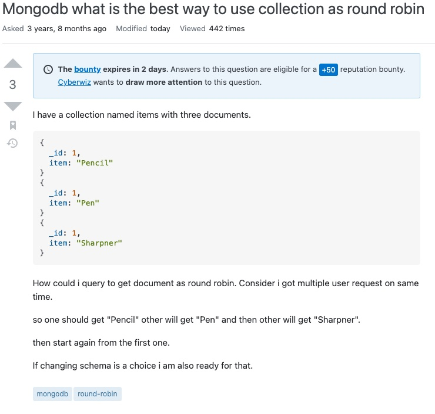

# Stack Overflow - 
## Mongodb what is the best way to use collection as round robin 
[see at StackOverflow](https://stackoverflow.com/questions/51214328/mongodb-what-is-the-best-way-to-use-collection-as-round-robin)

**Description of solution**

Use an update of type [FindOneAndUpdate](https://www.mongodb.com/docs/manual/reference/method/db.collection.findAndModify/#std-label-db.collection.findAndModify-let-example) with a pipeline

**Data object:**
`{
"values" : [
"Pencil",
"Pen",
"Sharpener"
],
"selected" : "Pencil",
"counter" : 1
}`

**Pipeline:**
`
[{$project: {
values: 1,
selected: {
$arrayElemAt: [
'$values',
'$counter'
]
},
counter: {
$mod: [
{
$add: [
'$counter',
1
]
},
{
$size: '$values'
}
]
}
}}]
`
# Using a separate counter to advance round-robin through another collection
###  Example1  covered the cases of a small set of elements, but as the number of elements grows the execution time increases as well.   Using two collections a counter and another for the elements should decrease the time of execution by using two queries to accomplish the task

**The update is simpler:**

[{$project: {
counter: {
$mod: [
{
$add: [
'$counter',
1
]
},
50000
]
}
}}]``
``

It returns a number that can be an indexed field in another collection.
This method takes two queries to get the result but ultimately faster when dealing with
a large number items.